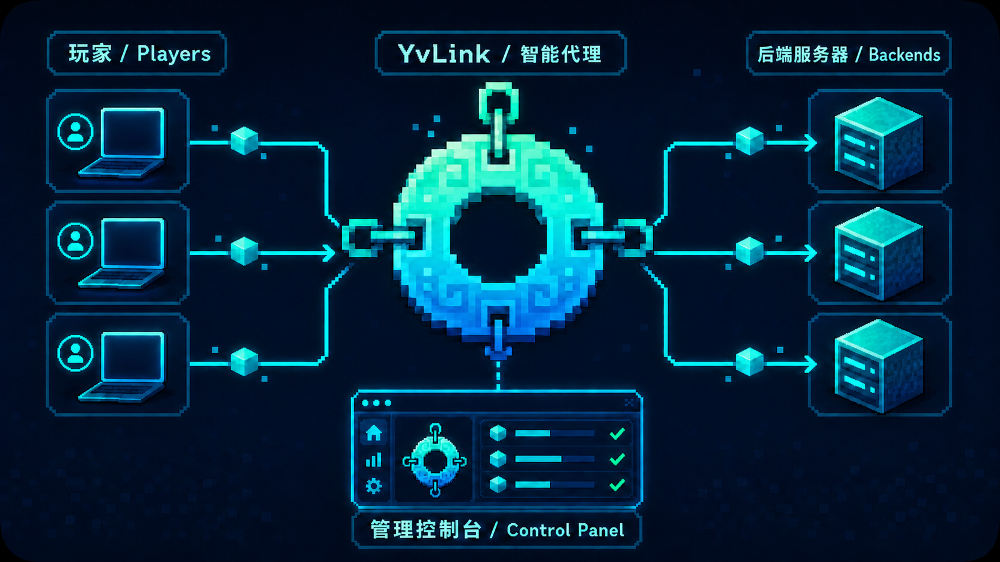

<div align="center">
  
  <h1>YvLink · mc-proxy</h1>
  <p>Protocol-aware Minecraft Java proxy with a web control panel</p>
  <p>
    <a href="docs/api.html">API reference</a> ·
    <a href="MODDED_COMPATIBILITY.md">Modded compatibility</a> ·
    <a href="CROSSPLAY.md">Crossplay</a>
  </p>
</div>

> **English translation fork of [baiyun1123/YvLink](https://github.com/baiyun1123/YvLink)** (v0.15.0).
> The original author and [AGPL-3.0-only license](LICENSE) remain credited upstream.



---

## Overview

YvLink (package name: `mc-proxy`) is a high-performance Minecraft Java TCP forwarding proxy built with Rust and Tokio. It parses the initial Handshake, Status, and Login Start packets, selects a backend using the hostname requested by the client, and transparently relays subsequent game and mod-loader traffic.

An embedded web control panel lets operators manage routes, backend pools, status responses, allowlists, health checks, and crossplay settings without manually editing TOML and restarting the service.

Current development version: **v0.15.0**

## Downloads

Upstream packages are available from [YvLink releases](https://github.com/baiyun1123/YvLink/releases/latest). The English fork is built by [GitHub Actions](https://github.com/Cercle-Magellan-FPMs/mc-reverse-proxy/actions). GitHub’s automatically generated `Source code (zip)` archive is not an installation package.

| File | Platform |
| --- | --- |
| `YvLink-ubuntu-22.04-x86_64.tar.gz` | Ubuntu 22.04 or compatible x86_64 glibc Linux |
| `YvLink-ubuntu-24.04-x86_64.tar.gz` | Ubuntu 24.04 or newer x86_64 glibc Linux |
| `YvLink-linux-musl-x86_64.tar.gz` | Portable x86_64 build for Alpine and most Linux distributions |
| `YvLink-linux-musl-aarch64.tar.gz` | ARM64 Linux, ARM servers, and 64-bit Raspberry Pi systems |
| `YvLink-windows-2022-x86_64.zip` | 64-bit Windows |

## Features

- Host-based routing through one public port, including exact hosts, `*`/`?` wildcards, and a default fallback rule.
- Up to 128 backends per route with sequential, random, round-robin, least-connections, and lowest-latency strategies.
- Automatic connection failover plus optional TCP or Minecraft Status protocol health checks.
- Fully custom server-list responses, or backend responses with selective field overrides.
- Preservation of Forge/NeoForge extensions, favicon, player samples, and unknown Status JSON fields.
- Pre-login player-name allowlists with customizable disconnect messages.
- PROXY Protocol v1/v2 for trusted backends that explicitly support it.
- Transparent bidirectional forwarding for Vanilla, Fabric, Forge, and NeoForge traffic after routing.
- Web-based configuration, runtime metrics, backend health details, and a 60-second live throughput chart.
- Bearer-token protected management API and atomic configuration persistence.
- Bedrock crossplay with two providers: an external Geyser Standalone process, or a GeyserLite instance managed directly by YvLink (no JVM required); both are verified with a real RakNet Pong probe.
- Optional managed ViaLite subprocess for Java backend version compatibility after routing.
- A systemd updater with version checks, atomic replacement, and rollback.
- Graceful Ctrl+C/SIGTERM shutdown, connection limits, timeouts, and optional Linux/Android `SO_REUSEPORT`.

## How It Works

```text
Java clients
    │  TCP :25565 (requested hostname in Handshake)
    ▼
YvLink
    ├─ matches Host rules in order
    ├─ selects a healthy backend
    ├─ optionally handles Status / allowlist
    └─ transparently relays later packets
        ├─ Backend A
        ├─ Backend B
        └─ Backend C

Browser ── HTTP :18080 / HTTPS reverse proxy ── Web UI and management API
```

Multiple domains can share the same listener. YvLink reads the virtual host from the Minecraft Handshake, uses the first matching rule, and selects a node from that rule’s backend pool. If the preferred node cannot be reached, the remaining nodes are tried automatically.

## Requirements

### Development and Local Use

| Item | Requirement |
| --- | --- |
| Rust | 1.88 or newer |
| Cargo | Installed with the Rust toolchain |
| Operating system | Linux recommended; other Rust/Tokio platforms may build from source |
| Admin token | `MC_PROXY_ADMIN_TOKEN`, at least 32 characters |
| Node.js | Only needed for the optional frontend JavaScript syntax check |

Install Rust:

```sh
curl --proto '=https' --tlsv1.2 -sSf https://sh.rustup.rs | sh
rustc --version
cargo --version
```

### Optional Production Components

| Component | Purpose |
| --- | --- |
| Nginx | HTTPS reverse proxy for the loopback-only management listener |
| systemd | Service supervision, restart policy, and start on boot |
| Certbot | Let’s Encrypt certificate issuance and renewal |
| Java 21 + Geyser Standalone | Bedrock connectivity only with `provider = "external"` |
| GeyserLite build feature | Managed Bedrock translator with `provider = "geyserlite"`, no JVM needed |
| ViaLite (optional) | Java backend version compatibility, installed with `deploy/install-vialite.sh` |

## Quick Start

### 1. Clone and Build

```sh
git clone https://github.com/Cercle-Magellan-FPMs/mc-reverse-proxy.git
cd mc-reverse-proxy
cargo build --release
```

Bedrock crossplay uses GeyserLite by default (default features `geyserlite` + `geyserlite-download`; the native library is fetched at runtime and verified with SHA-256. The managed translator is compiled only for Linux targets; Windows packages use the external Geyser Standalone). Other build modes:

```sh
# Embed libgeyserlite.so into the binary, suitable for offline production
cargo build --release --features geyserlite-embed
# Remove the managed translator entirely, keeping only external Geyser monitoring
cargo build --release --no-default-features
```

If you are already in the project directory:

```sh
cargo build --release
```

### 2. Create a Configuration

```sh
cp config.example.toml config.toml
```

Update at least one `[[rules]]` entry with your real `host` and `backend`. If no backend is ready yet, start with:

```toml
[settings]
proxy_enabled = false
```

This starts the control panel without exposing a Minecraft listener that has no usable backend.

### 3. Set the Admin Token

Generate a random token:

```sh
openssl rand -hex 32
```

Export it for the current shell:

```sh
export MC_PROXY_ADMIN_TOKEN='replace-with-a-strong-token-of-at-least-32-characters'
export RUST_LOG='mc_proxy=info'
```

Never commit this token to Git, publish it in documentation, or embed it in frontend code.

### 4. Run

Run the release binary:

```sh
./target/release/mc-proxy --config config.toml
```

Or build and run through Cargo:

```sh
MC_PROXY_ADMIN_TOKEN='replace-with-a-strong-token-of-at-least-32-characters' \
RUST_LOG='mc_proxy=info' \
cargo run --release -- --config config.toml
```

Default endpoints:

- Minecraft Java listener: `0.0.0.0:25565`
- Web control panel: `http://127.0.0.1:18080`
- Health endpoint: `http://127.0.0.1:18080/healthz`
- API documentation: `http://127.0.0.1:18080/docs/api`

Press `Ctrl+C` to stop the service gracefully.

## Configuration

See [`config.example.toml`](config.example.toml) for the complete commented example. A minimal multi-backend route:

```toml
[admin]
listen = "127.0.0.1:18080"

[crossplay]
enabled = false
provider = "external"
bedrock_listen = "0.0.0.0:19132"
java_address = "bedrock.example.com"
java_port = 25565
auth_type = "online"

[crossplay.geyserlite]
mode = "embedded"
offline = false
motd_line1 = "YvLink"
motd_line2 = "Bedrock via GeyserLite"

[via]
enabled = false
# binary_path = "/opt/mc-proxy/vialite/vialite"
runtime_dir = "/run/mc-proxy/vialite"
gate_protocol = "auto"
backend_version = "auto"

[settings]
listen = "0.0.0.0:25565"
proxy_enabled = true
max_connections = 10000
connect_timeout_ms = 5000
handshake_timeout_ms = 5000
shutdown_grace_secs = 30
copy_buffer_bytes = 32768
socket_buffer_bytes = 1048576
listen_backlog = 4096
tcp_nodelay = true
reuse_port = false
stats_interval_secs = 10

[[rules]]
id = "survival"
name = "Survival"
host = ["play.example.com", "*.play.example.com"]
backend = ["10.0.0.2:25565", "10.0.0.3:25565"]
strategy = "least-connections"
proxy_protocol = "off"
modify_virtual_host = false
whitelist_enabled = false
whitelist = []
crossplay_enabled = false
enabled = true

[rules.health_check]
enabled = true
mode = "minecraft-status"
interval_secs = 30
timeout_ms = 2000
unhealthy_threshold = 3
healthy_threshold = 2
minecraft_protocol = 769

[rules.status]
mode = "backend"
cache_ttl_secs = 30

[rules.status.fallback]
motd = "§cServer temporarily offline"
version_name = "Backend unavailable"
protocol = -1
online = 0
max = 100
```

### Important Options

| Option | Description |
| --- | --- |
| `admin.listen` | Web management listener; keep it on loopback in production |
| `settings.listen` | Shared TCP listener for all Java hostnames |
| `settings.proxy_enabled` | Enables or disables the Minecraft forwarding listener |
| `rules.host` | One host or a host array; rules are matched in file order |
| `rules.backend` | One backend or a backend array, formatted as `host:port` |
| `rules.strategy` | `sequential`, `random`, `round-robin`, `least-connections`, or `lowest-latency` |
| `rules.modify_virtual_host` | Rewrites the Handshake host to the backend hostname |
| `rules.crossplay_enabled` | Allows this enabled route to serve as the Java upstream for global Bedrock Crossplay; defaults to `false` |
| `rules.proxy_protocol` | `off`, `v1`, or `v2`; ordinary Minecraft servers normally require `off` |
| `rules.health_check.mode` | `tcp` checks reachability; `minecraft-status` validates Status JSON and Ping/Pong |
| `rules.status.mode` | `custom` generates a response; `backend` preserves the backend response and overrides selected fields |
| `via.enabled` | Enables ViaLite Java backend compatibility; requires an installed absolute `binary_path` |
| `via.backend_version` | Target backend version; use an explicit value when Status detection is blocked |

Rules are evaluated in file order. A catch-all rule using `host = "*"` must therefore be placed last.

### ViaLite Java Backend Compatibility

ViaLite runs after YvLink selects a route and before it connects to the Java backend. It handles Java protocol differences; GeyserLite handles Bedrock-to-Java translation. YvLink manages a separate ViaLite subprocess and loopback listener for each unique backend.

Install the verified runtime before enabling ViaLite in the console or configuration:

```sh
sudo install -m 0755 deploy/install-vialite.sh /usr/local/lib/mc-proxy/install-vialite.sh
sudo /usr/local/lib/mc-proxy/install-vialite.sh
```

Every route must use `proxy_protocol = "off"` while ViaLite is enabled. YvLink does not provide Velocity or BungeeCord identity forwarding.

### Automatic Updates

The optional updater downloads the Ubuntu 24.04 x86_64 package from upstream YvLink releases. It checks the binary version, replaces the executable atomically, and restores the previous version if the service cannot restart. An upstream release may replace this fork's English translation; leave the timer disabled to retain this build. It does not edit `/etc/mc-proxy/config.toml`.

### NotEnoughBandwidth (NEB)

[NotEnoughBandwidth](https://github.com/USS-Shenzhou/NotEnoughBandwidth) is a Fabric client/server mod, not a library embedded in YvLink. Install it on compatible clients and backends, then test any Velocity or protocol translation path. YvLink transparently forwards later mod traffic.

## Web Control Panel and API

The management server listens on `127.0.0.1:18080` by default. Enter the same token as `MC_PROXY_ADMIN_TOKEN` when the browser asks for it. The token is stored in this browser's `localStorage` until you log out.

Use Nginx to expose the control panel over HTTPS in production. Do not bind the management listener directly to a public interface. Included resources:

- [`deploy/nginx-mc.lic6.top.conf`](deploy/nginx-mc.lic6.top.conf): Nginx reverse-proxy example.
- [`deploy/nginx-rate-limit.conf`](deploy/nginx-rate-limit.conf): API rate-limit example.
- [`docs/api.html`](docs/api.html): responsive, searchable API documentation.

## Production Deployment

The upstream [Ubuntu 24.04 build log](BUILD_UBUNTU24.md) documents its build and verification procedure (Chinese). Recommended layout:

```text
/opt/mc-proxy/mc-proxy
/etc/mc-proxy/config.toml
/etc/mc-proxy/admin.env
/etc/systemd/system/mc-proxy.service
```

Create the token environment file:

```sh
sudo install -d -m 0750 /etc/mc-proxy
sudo sh -c "umask 077; printf '%s\n' 'MC_PROXY_ADMIN_TOKEN=replace-with-a-strong-random-token' > /etc/mc-proxy/admin.env"
```

Before installing the unit, review the user, paths, and permissions in [`deploy/mc-proxy.service`](deploy/mc-proxy.service):

```sh
sudo cp deploy/mc-proxy.service /etc/systemd/system/mc-proxy.service
sudo systemctl daemon-reload
sudo systemctl enable --now mc-proxy
sudo systemctl status mc-proxy
```

Common operations:

```sh
journalctl -u mc-proxy -f
systemctl restart mc-proxy
nginx -t
certbot certificates
```

Open only the ports required by your deployment:

- `25565/tcp`: public Minecraft Java listener.
- `80/tcp`, `443/tcp`: Nginx HTTP/HTTPS.
- `19132/udp`: only when a Bedrock crossplay listener (external or geyserlite) is configured and enabled.
- `18080/tcp`: keep this on loopback; do not expose it publicly through the firewall.

## Verification

```sh
cargo fmt --check
cargo clippy --all-targets -- -D warnings
cargo test --all-targets
node --check web/app.js
```

Check a running instance:

```sh
curl -fsS http://127.0.0.1:18080/healthz
```

## Modded and Crossplay Boundaries

- Forge/FML NUL extensions in the Handshake host are preserved, and later Fabric, Forge, and NeoForge traffic is relayed transparently.
- This is currently a thin proxy: it does not terminate online-mode authentication or generate Velocity modern forwarding/BungeeCord player data.
- The allowlist is only an early filter before backend authentication; it is not a substitute for Minecraft online-mode identity verification.
- PROXY Protocol only carries source/destination addresses. It does not translate Java protocol versions or replace Velocity/Bungee forwarding.
- A Minecraft Status health check proves only that the server-list protocol works. It does not prove successful authentication, mod negotiation, or gameplay.
- Bedrock clients can connect through an external Geyser Standalone or the managed GeyserLite translator (Linux targets only). In embedded mode GeyserLite shares the YvLink process, so a native crash terminates the whole process and config changes require a service restart; use subprocess mode for isolation and live updates.

Further reading (upstream documents in Chinese):

- [`MODDED_COMPATIBILITY.md`](MODDED_COMPATIBILITY.md): Vanilla, Fabric, Forge, and NeoForge compatibility matrix and limitations.
- [`CROSSPLAY.md`](CROSSPLAY.md): Geyser/Floodgate architecture, authentication, and deployment.
- [`tests/MODDED_MATRIX_RUNBOOK.md`](tests/MODDED_MATRIX_RUNBOOK.md): reproducible real mod-loader server matrix.

## Performance Notes

Each connection uses a 32 KiB userspace buffer per direction by default. Traffic metrics are incremented when bytes are successfully written to the opposite side, so long-lived connections do not need to close before the dashboard updates.

Tune 16, 32, 64, and 128 KiB buffers using real Minecraft protocol clients. Do not use an HTTP benchmark as a substitute for game-protocol traffic. Before raising `max_connections`, review file-descriptor limits, memory, and backend capacity.

## License

YvLink is licensed under the [GNU Affero General Public License v3.0 only](LICENSE) (`AGPL-3.0-only`).

- Personal, corporate, modified, redistributed, and commercial use is permitted.
- Modified distributions must provide the corresponding source and preserve the license notices as required by AGPL v3.
- If a modified version interacts with users over a network, those users must be offered its corresponding source at no charge.
- This software license does not grant permission to use the `YvLink` project name or logo as a trademark.
